# SkillSwap AI

> AI-powered marketplace for students and young creators — Smart India Hackathon Track 2.

SkillSwap AI is **not** a Fiverr clone. Creators showcase proof of skill through AI-generated portfolios, clients get trust-weighted talent matches, and bookings move through a milestone-safe workflow.

---

## Screenshots

| Landing | Login | Register |
| --- | --- | --- |
| 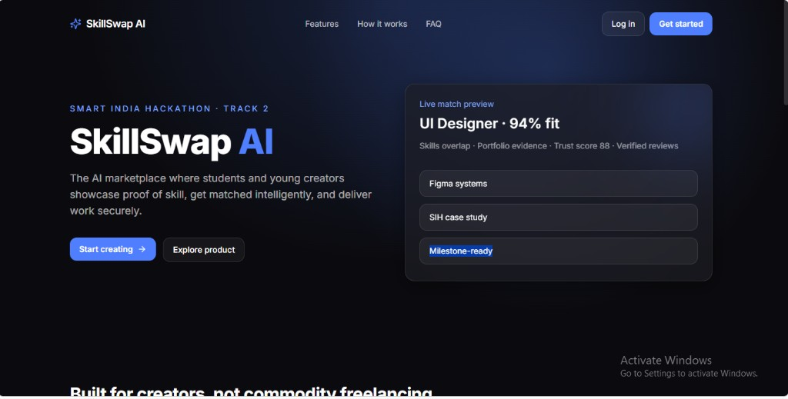 | 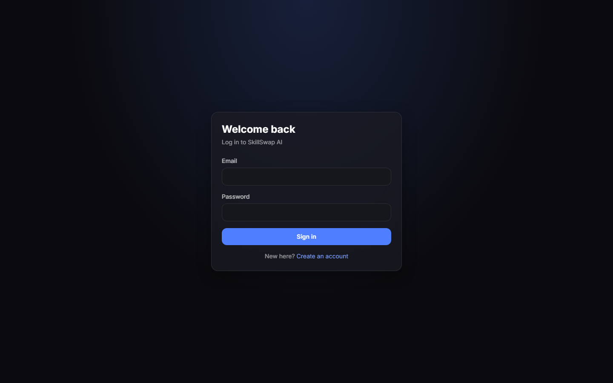 | 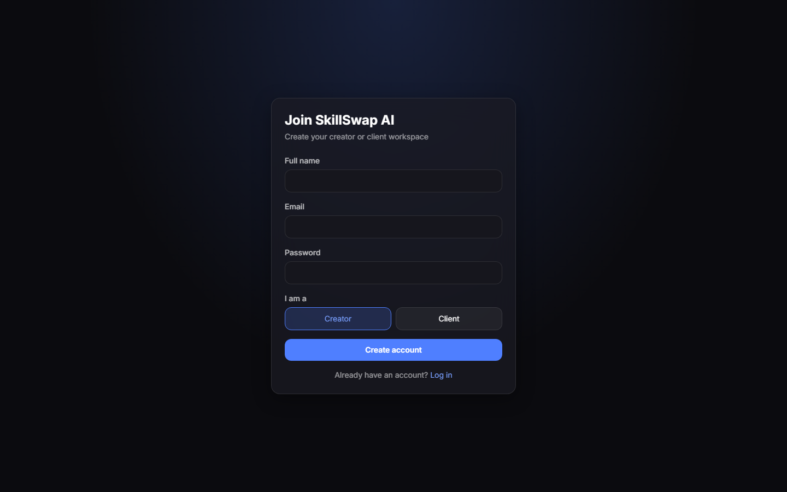 |

| Creator dashboard | AI Portfolio Builder | Portfolio |
| --- | --- | --- |
| 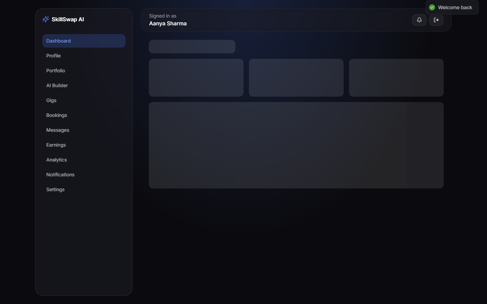 | 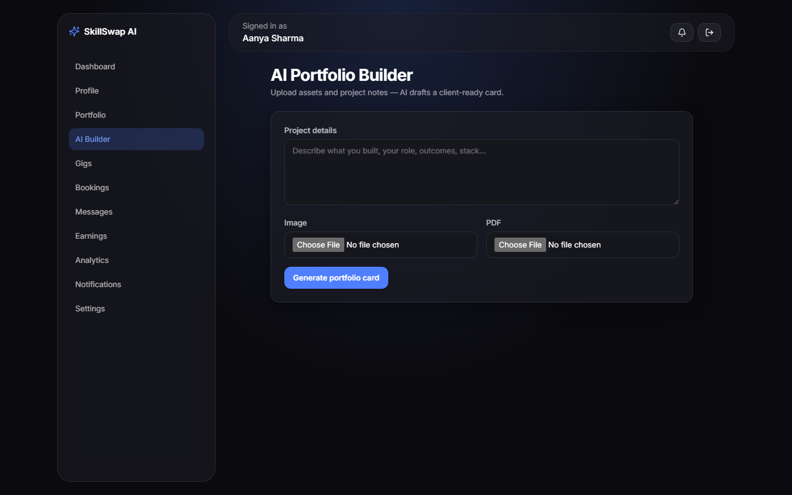 | 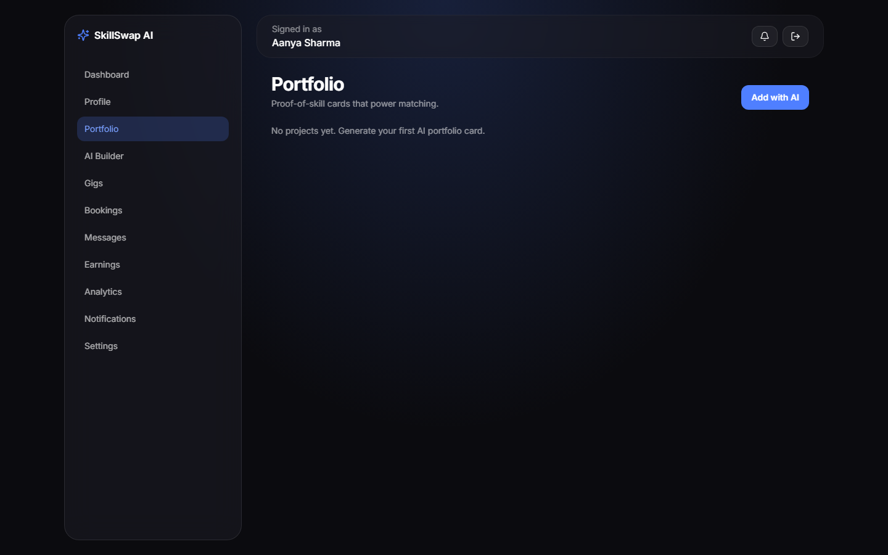 |

| Client dashboard | Post job | Browse creators |
| --- | --- | --- |
| 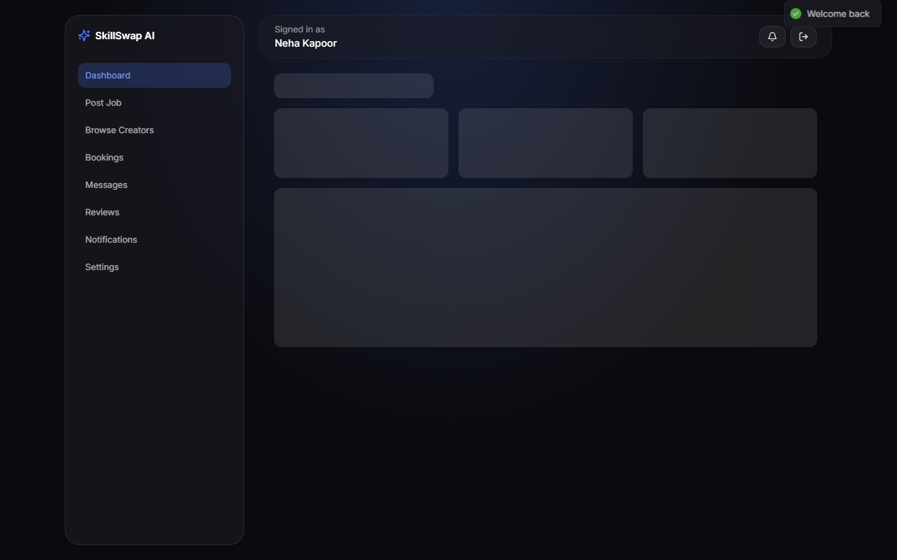 | 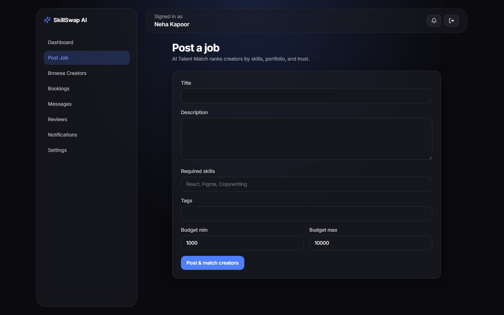 | 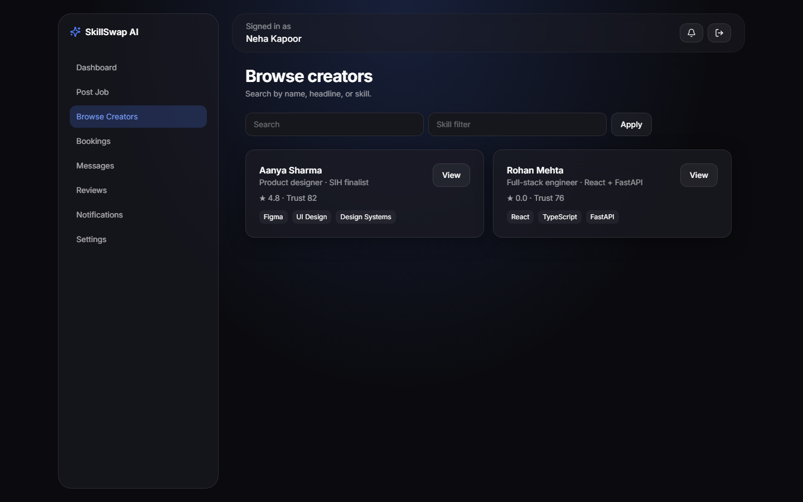 |

| Gigs | API docs |
| --- | --- |
| 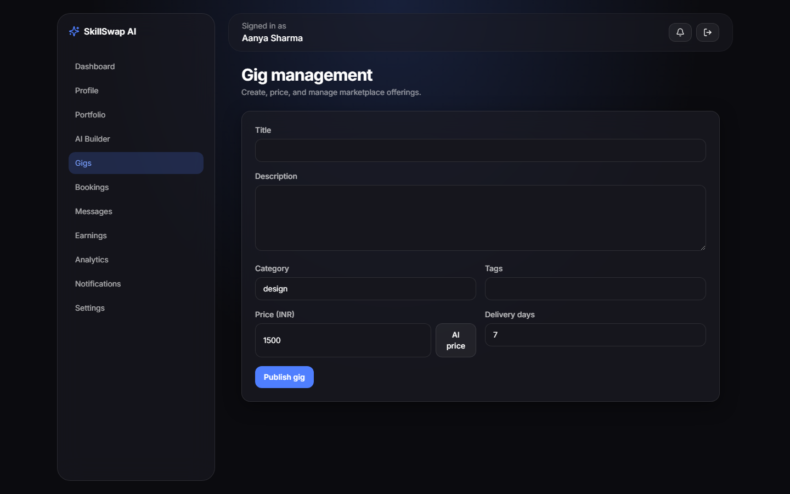 | 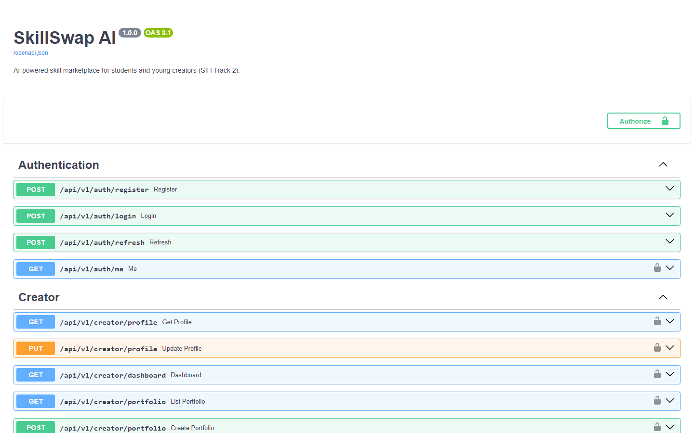 |

Live demo: [skillswap-ai-ecru.vercel.app](https://skillswap-ai-ecru.vercel.app)


---

## Architecture

```
┌─────────────┐     HTTPS      ┌────────────────┐     SQL      ┌──────────────────┐
│  Vercel FE  │ ─────────────► │ Railway FastAPI│ ───────────► │ Supabase Postgres│
│ React/Vite  │                │ JWT · AI · WS  │              │                   │
└─────────────┘                └───────┬────────┘              └──────────────────┘
                                       │ uploads
                                       ▼
                               ┌──────────────┐
                               │  Cloudinary  │
                               └──────────────┘
```

- **Frontend:** React 18, Vite, TypeScript, Tailwind, React Query, Framer Motion
- **Backend:** FastAPI, SQLAlchemy, Alembic, JWT + refresh tokens, SlowAPI rate limits
- **AI:** OpenAI-compatible provider abstraction (`generate_portfolio`, `match_creators`, `suggest_pricing`, `chat_assistant`)
- **Realtime:** WebSocket chat at `/api/v1/ws/chat`

---

## Local setup

> This machine did not have Node.js, Python, Git, or Docker installed when the project was scaffolded. Install Node 20+ and Python 3.11+, then follow below. **Docker is optional** and not required.

### 1. Backend

```bash
cd backend
python -m venv .venv

# Windows
.venv\Scripts\activate

# macOS/Linux
source .venv/bin/activate

pip install -r requirements.txt
copy .env.example .env   # or: cp .env.example .env
```

Edit `.env`:

- Local quickstart: keep `DATABASE_URL=sqlite:///./skillswap.db` (or the default in `config.py`)
- Production: Supabase Postgres URL (`postgresql+psycopg2://...`)

```bash
# Optional migrations (Postgres recommended)
alembic upgrade head

# Load demo users + sample gigs/jobs/bookings
python -m app.seed

uvicorn app.main:app --reload --port 8000
```

Demo login (password `Demo@12345`):

- Creator: `creator@skillswap.ai`
- Creator 2: `creator2@skillswap.ai`
- Client: `client@skillswap.ai`

API docs: [http://localhost:8000/docs](http://localhost:8000/docs)

### 2. Frontend

```bash
cd frontend
copy .env.example .env
npm install
npm run dev
```

App: [http://localhost:5173](http://localhost:5173)

---

## Core features

1. **AI Portfolio Builder** — upload image/PDF + project notes → AI title, description, skills, tools, portfolio card
2. **AI Talent Match** — job → compatibility score + reasons (skills, tags, experience, portfolio, trust)
3. **Gig marketplace** — create/edit/delete, browse/filter/search/save
4. **Booking workflow** — Pending → Accepted → In Progress → Submitted → Completed (+ milestones)
5. **Verified reviews** — only after completed bookings
6. **Advanced** — WebSocket chat, notifications, saved creators/jobs, analytics

---

## API overview

Base path: `/api/v1`

| Method | Path | Description |
| --- | --- | --- |
| POST | `/auth/register` | Register creator/client |
| POST | `/auth/login` | Login |
| POST | `/auth/refresh` | Refresh JWT |
| GET | `/auth/me` | Current user |
| GET/PUT | `/creator/profile` | Creator profile |
| POST/GET | `/creator/portfolio` | AI portfolio |
| GET | `/creator/dashboard` | Creator stats |
| CRUD | `/gigs` | Marketplace gigs |
| POST/GET | `/jobs` | Client jobs |
| GET | `/client/jobs/{id}/matches` | Talent match |
| POST/PUT/GET | `/booking` | Bookings |
| POST | `/review` | Verified review |
| POST/GET | `/messages` | Chat REST |
| WS | `/ws/chat?token=` | Realtime chat |
| GET | `/notifications` | Inbox |
| POST | `/ai/assistant` | Assistant |
| POST | `/ai/pricing` | Pricing suggest |

Full interactive docs: `/docs` (OpenAPI).

---

## Deployment

### Database — Supabase

1. Create a Supabase project
2. Copy the Postgres connection string
3. Set `DATABASE_URL` on Railway
4. Run `alembic upgrade head` (or rely on `init_db()` on first boot)

### Backend — Railway

1. New Railway service from `backend/`
2. Start command: `uvicorn app.main:app --host 0.0.0.0 --port $PORT`
3. Set env vars from `backend/.env.example`
4. Add your Vercel origin to `CORS_ORIGINS`

### Frontend — Vercel

1. Import `frontend/` as the root
2. Build: `npm run build`
3. Output: `dist`
4. Set `VITE_API_URL=https://YOUR_RAILWAY_URL/api/v1`

### Docker (optional)

`docker-compose.yml` is provided for teams that already have Docker. **Do not install Docker solely for this project** — local venv + npm is enough.

---

## Security

- bcrypt password hashing
- JWT access + refresh tokens
- CORS allowlist
- SlowAPI rate limiting
- Pydantic input validation
- SQLAlchemy parameterized queries
- Cloudinary upload type/size checks

---

## Product decisions

See [DECISIONS.md](./DECISIONS.md).

---

## License

MIT — built for code2careers hackathon.
